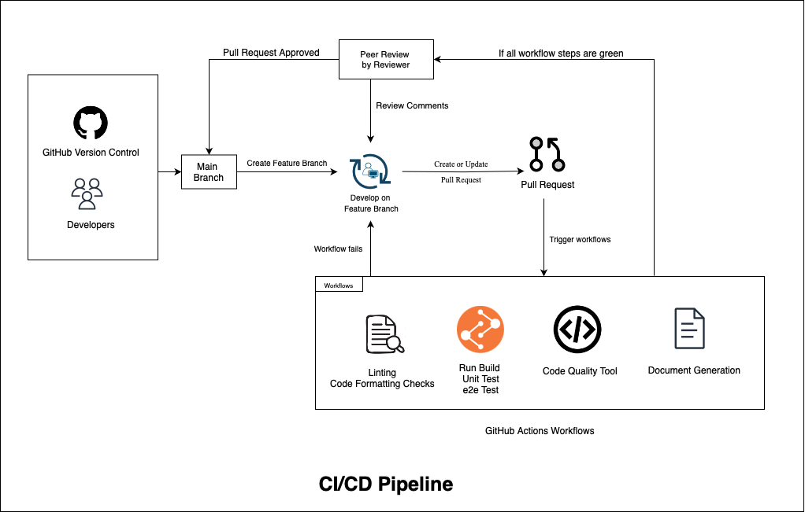

## CI/CD Pipeline Progress Report

## Current Status

### Code Analysis & Style Workflow:  

- **ESLint**: ESLint is set up to analyze code for potential errors and is automatically triggered on creating a Pull Request.
- **CodeClimate**: We are in process of setting up CodeClimate which is the code quality tool.

### Unit Testing Workflow  
- **Unit Testing**: Mocha set up is working, the Unit Testing Workflow runs whenever a pull request is created.
- **E2E Testing**: 
We have not yet decided how to proceed on the end-to-end testing. We will be working on it in Sprint 3.

### Documentation Workflow
- **Documentation**: TypeDoc (Through [typedoc-action](https://github.com/TypeStrong/typedoc-action)) that generates the documentation.

### Code Review Workflow

- Pull requests with mandatory team review and approval. 
- Atleast 2 reviewers should be added to every pull request. 
- Code can be merged to main only when all the workflows pass.

### CI/CD Process
- **Build Process**: No Build stage currently. We will be adding this in the Sprint 2.
- **Deployment**: We plan to host our web application directly on GitHub Pages to start with.

## Pipeline

## Planned Enhancements

### Short-term Goals (Planned in Sprint 2 & 3)
- Add a workflow to generate the build artifacts that can be used to install the VSCode extension locally.
- Identify if e2e (end-to-end) and pixel testing would be required for our application.

### Long-term Objectives
- Add a deployment workflow that would publish the artifacts to VSCode Marketplace.

## In-Progress Developments

- Working on setting up CodeClimate with GitHub Actions so that the reports are generated in CodeClimate.

## Performance Metrics

- **Improvement Areas**: Once we have the complete CI/CD pipeline in place, we want to also document the key performance metrics like Average Build Time, Deployment Frequency, Time to deploy.