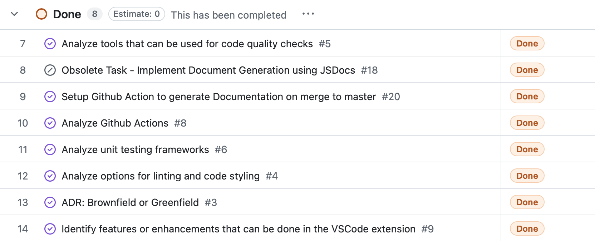

# Sprint Review Meeting - Sprint 1

**Date:** Nov 16, 2024  
**Location:** Virtual Meeting

## Welcome and Introduction

- Meeting purpose: Review of Sprint 1 and gather feedback
- Attendees: Tanmay, Mokshita, Kshitij, Angus, Chris, Fude, Jyotika, Rohan, Chris C

## Sprint Goal Review

Sprint goal: 
- Understand the existing VSCode extension code and identify the complexities involved in implementing the proposed features. 
- Analyze the tools to use for linting, code styling, code quality, documentation, unit and/or e2e testing.
 

Goal achievement status: Partially achieved - need to try out code quality tool integration

## Sprint Backlog Review 

### Completed items:

### Incomplete items:

- Analyze Documentation generation via automation	https://github.com/cse210-fa24-group13/codesnip/issues/7

### Deviations from original plan:

- We had to revisit the decision of using both Javascript and Typescript for maintaining both the VSCode extension and Web Browser Application. 
- This resulted in changing the tool we use for automated documentation generation.
- We will be using TypeDoc now and stick to using Typescript.

## Feedback and Questions

- Feedback: N/A    
- Questions: 
    - How does the automated documentation generation work and what all changes we might have to do in the existing codebase?
    - What is the current test coverage of existing code and how feasible it is to invest time in writing tests in the initial sprints?  
- Concerns / Suggestions:
    - Consider making changes to the existing VSCode Extension and rebuilding, so that we can understand how to build and test changes on local.

## Product Backlog Update

- Current state of product backlog:
    - Fix the failing Unit Test Step in Github Action: https://github.com/cse210-fa24-group13/codesnip/issues/13
    - Documentation for CI/CD Pipeline setup: https://github.com/cse210-fa24-group13/codesnip/issues/15
    - Diagram for CI/CD Pipeline setup: https://github.com/cse210-fa24-group13/codesnip/issues/16
    - Snippet creation confirmation page: https://github.com/cse210-fa24-group13/codesnip/issues/23
    - Ability to share snippets: https://github.com/cse210-fa24-group13/codesnip/issues/24
    - Provide shortcut keys to import snippets in code: https://github.com/cse210-fa24-group13/codesnip/issues/25

- Priority changes:
    - Create Group Presentation for Reading #4 Assignment: https://github.com/cse210-fa24-group13/codesnip/issues/17 
- New items:
    - Understand how to recompile VSCode extension on local: https://github.com/cse210-fa24-group13/codesnip/issues/26

## Next Steps and Action Items (10 minutes)

### Key decisions:

We will be using 2 days of Sprint 2 to create the required documentaiton for CI/CD Pipeline Setup and Group Presentation Assignment

### Action items:
1. CI/CD Pipeline Documentation || Responsible: Chris, Tanmay, Chris C - Due: 16/11/2024
2. Reading #4: Group Presentation || Responsible: Mokshita, Jyotika, Rohan - Due: 19/11/2024
3. Backlog Items || Responsible: Kshitij, Angus, Fude - Due: Ongoing

## Closing Remarks
    
- Next sprint planning session: Nov 16, 2024 (Completed after the Sprint Review and Retrospective Meeting)

