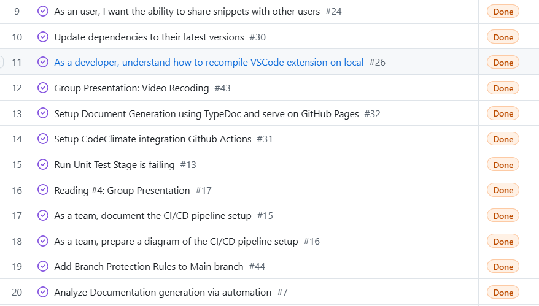

# Sprint Review Meeting - Sprint 1

**Date:** Nov 23, 2024  
**Location:** Virtual Meeting

## Welcome and Introduction

- Meeting purpose: Review of Sprint 2
- Attendees: Tanmay, Mokshita, Kshitij, Angus, Chris, Fude, Jyotika, Rohan, Chris C

## Sprint Goal Review

Sprint goal: 
- Recompile and run the VS code extension after making small changes to the code
- Update dependancies
- Setup CodeClimate, serve documentation being generated on Github Pages 
- Documenting the CI/CD pipeline setup.
- Start implementing the main feature of sharing snippets across users
 

Goal achievement status: Completely achieved 

## Sprint Backlog Review 

### Completed items:

## Feedback and Questions

- Feedback: N/A    
- Questions: 
    - Would GitHub Gists satisfy our snippet sharing requirements? Is it a feasible option? Are there potential unexpected pitfalls?

## Current Tasks 

- Current tasks to be taken care of:
    - GitHub GIST ADR: https://github.com/cse210-fa24-group13/codesnip/issues/39 (Urgent)
    - Sprint 1 & 2 update video https://github.com/cse210-fa24-group13/codesnip/issues/41 (Urgent) 
    - Create user interface, that allows me to see all the created snippets: https://github.com/cse210-fa24-group13/codesnip/issues/36
    - As an user, I would want to see a confirmation dialogue when user uses a snippet: https://github.com/cse210-fa24-group13/codesnip/issues/23
    - GitHub Gist Api Exploration: https://github.com/cse210-fa24-group13/codesnip/issues/40
    - GitHub Authentication Exploration: https://github.com/cse210-fa24-group13/codesnip/issues/42
    - Update README.md: https://github.com/cse210-fa24-group13/codesnip/issues/47

## Closing Remarks
    
- Next sprint planning session: Nov 23, 2024 (Completed after the Sprint Review and Retrospective Meeting)

